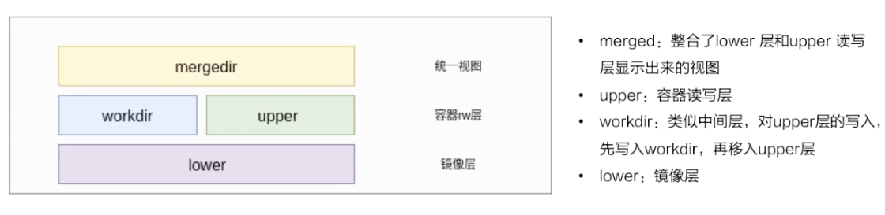

### `Overlay2`

`OverlayFS`将单个`Linux`主机上的两个目录合并成一个目录。这些目录被称为层，统一过程被称为联合挂载
`OverlayFS`底层目录称为`lowerdir`， 高层目录称为`upperdir`,合并统一视图称为`merged`

```
                   ├───────────────────────────────────│
  Container Mount  │ FILE 1 │ FILE 2 │ FILE 3 │ FILE 4 │       "merged"
                   ├────↑────────↑────────↑───────↑────│
  Container layer  │    ↑   │ FILE 2 │    ↑   │ FILE 4 │       "upperdir"
                   ├────↑─────────────────↑────────────│
     Image layer   │ FILE 1 | FILE 2 | FILE 3 |        │       "lowerdir"
                   ├───────────────────────────────────│
```

#### 存储流程


* 最下层是`lower`层,也是只读/镜像层
* `upper`是容器的读写层,采用了`CoW`(写时复制)机制,只有对文件进行修改才会将文件拷贝到`upper`层,之后所有的修改操作都会对`upper`层的副本进行修改
* `upper`并列还有`workdir`层,它的作用是充当一个中间层的作用,每当对`upper`层里面的副本进行修改时,会先当到`workdir`,然后再从`workdir`移动`upper`层
* 最上层是`mergedir`,是一个统一图层,从`mergedir`可以看到`lower`,`upper`,`workdir`中所有数据的整合,整个容器展现出来的就是`mergedir`层.


-------------------------------

#### `image layer` 和 `OverlayFS`


每一个`Docker image`都是由一系列`read-only layer`组成的.`Image layer`的内容都存储在`Docker hosts filesystem`的`/var/lib/docker/overlay2`下面

如果在没有拉取任何镜像的前提下,可以发现没有存储任何内容的

```Bash
root@DESKTOP-UMENNVI:# ls -htral /var/lib/docker/overlay2
总用量 12K
drwx--x--x 15 root root 4.0K 3月   2 17:50 ..
drwx------  2 root root 4.0K 3月   2 17:50 l        ## 这里面都是软连接文件目录的简写标识，这个主要是为了避免mount时候页大小的限制
drwx------  3 root root 4.0K 3月   2 17:50 .
```

接下来拉取`ubuntu:18.04`镜像

```Bash
## 拉取 ubuntu:18.04 镜像
root@DESKTOP-UMENNVI:~# docker pull ubuntu:18.04
18.04: Pulling from library/ubuntu
35c102085707: Downloading 
251f5509d51d: Downloading 
8e829fe70a46: Downloading 
6001e1789921: Downloading 
18.04: Pulling from library/ubuntu
423ae2b273f4: Pull complete 
de83a2304fa1: Pull complete 
f9a83bce3af0: Pull complete 
b6b53be908de: Pull complete 
Digest: sha256:04d48df82c938587820d7b6006f5071dbbffceb7ca01d2814f81857c631d44df
Status: Downloaded newer image for ubuntu:18.04
docker.io/library/ubuntu:18.04

## 查看 /var/lib/docker/overlay2
root@DESKTOP-UMENNVI:/var/lib/docker/overlay2# tree . -L 3
.
├── 06c3268634199360b720ea7e484497424245bce0ac59ba02843d862eb2d3e975
│   ├── committed
│   ├── diff
│   │   └── var
│   ├── link
│   ├── lower
│   └── work
├── 141562f2c1d9915cdadf58d5d8dbfdbe664ac5645dba4bfbf4665167acef03c3
│   ├── committed
│   ├── diff
│   │   ├── etc
│   │   ├── sbin
│   │   ├── usr
│   │   └── var
│   ├── link
│   ├── lower
│   └── work
├── 1c6bdda320809e237e381ea7bf1936d837f4cb96cfa4fe5ddf2a0878c37d6cf7
│   ├── committed
│   ├── diff
│   │   ├── bin
│   │   ├── boot
│   │   ├── dev
│   │   ├── etc
│   │   ├── home
│   │   ├── lib
│   │   ├── lib64
│   │   ├── media
│   │   ├── mnt
│   │   ├── opt
│   │   ├── proc
│   │   ├── root
│   │   ├── run
│   │   ├── sbin
│   │   ├── srv
│   │   ├── sys
│   │   ├── tmp
│   │   ├── usr
│   │   └── var
│   └── link
├── 758c83af3abbe440d44aa9f8e1fb6feb93a7ea51d5deda031a6cece579f51c04
│   ├── diff
│   │   └── run
│   ├── link
│   ├── lower
│   └── work
└── l
    ├── 5VTK2ORIHBK33URDA6QHOTNXFW -> ../758c83af3abbe440d44aa9f8e1fb6feb93a7ea51d5deda031a6cece579f51c04/diff
    ├── CJEDSUSQJVOA4SKGDYKCO6D2BA -> ../1c6bdda320809e237e381ea7bf1936d837f4cb96cfa4fe5ddf2a0878c37d6cf7/diff
    ├── GRZIGIYAS45PEF36RWVHBM4LGT -> ../06c3268634199360b720ea7e484497424245bce0ac59ba02843d862eb2d3e975/diff
    └── U2YACKS2WP5XTR7QY4YSPU6AN4 -> ../141562f2c1d9915cdadf58d5d8dbfdbe664ac5645dba4bfbf4665167acef03c3/diff

41 directories, 10 files
```

1. 可以看到`Ubuntu:18.04` 镜像一共有`4`个`layer`,每层的`diff`即是文件系统在统一挂载时的挂载点

2. `l`文件夹下都是链接各个`layer`的软连接

3. 查看`1c6bdda320809e237e381ea7bf1936d837f4cb96cfa4fe5ddf2a0878c37d6cf7`这个目录,可以看到已经基本系统的雏形了

4. `lower`文件描述了层序的组织关系(前一个`layer`依靠后一个`layer`),比如查看

```Bash
root@DESKTOP-UMENNVI:/var/lib/docker/overlay2# cat 758c83af3abbe440d44aa9f8e1fb6feb93a7ea51d5deda031a6cece579f51c04/lower

l/U2YACKS2WP5XTR7QY4YSPU6AN4:l/GRZIGIYAS45PEF36RWVHBM4LGT:l/CJEDSUSQJVOA4SKGDYKCO6D2BA
```


#### 查看容器运行起来后的变化

接着以`Ubuntu:18.04`为基础镜像,创建一个名为`test-ubuntu`的镜像,这个镜像只是在`/tmp`文件夹中添加了`Hello World`文件,可以用`Dockerfile`来实现

```Dockerfile
FROM ubuntu:18.04

RUN echo "Hello World" > /tmp/newfile
```

执行构建镜像

```Bash
## 进入到构建镜像文件夹内
root@DESKTOP-UMENNVI:DockerLayer# docker build -t test-ubuntu .
Sending build context to Docker daemon  2.048kB
Step 1/2 : FROM ubuntu:18.04
 ---> 72300a873c2c
Step 2/2 : RUN echo "Hello World" > /tmp/newfile
 ---> Running in 0644707c9a4c
Removing intermediate container 0644707c9a4c
 ---> 8fe0d75009f9
Successfully built 8fe0d75009f9
Successfully tagged test-ubuntu:latest
```

然后执行 `docker images` 查看现有的镜像,可以清楚查看到`test-ubuntu`使用了哪些`image layer`

```Bash
root@DESKTOP-UMENNVI:# docker images
REPOSITORY          TAG                 IMAGE ID            CREATED             SIZE
test-ubuntu         latest              8fe0d75009f9        27 minutes ago      64.2MB
ubuntu              18.04               72300a873c2c        9 days ago          64.2MB

## 查看镜像构建layer层
root@DESKTOP-UMENNVI:# docker history test-ubuntu
IMAGE               CREATED             CREATED BY                                      SIZE                COMMENT
8fe0d75009f9        27 minutes ago      /bin/sh -c echo "Hello World" > /tmp/newfile    12B                 
72300a873c2c        9 days ago          /bin/sh -c #(nop)  CMD ["/bin/bash"]            0B                  
<missing>           9 days ago          /bin/sh -c mkdir -p /run/systemd && echo 'do…   7B                  
<missing>           9 days ago          /bin/sh -c set -xe   && echo '#!/bin/sh' > /…   745B                
<missing>           9 days ago          /bin/sh -c [ -z "$(apt-get indextargets)" ]     987kB               
<missing>           9 days ago          /bin/sh -c #(nop) ADD file:91a750fb184711fde…   63.2MB  
```

从输出中可以看到`8fe0d75009f9 image layer` 位于最上层,只有`12B`大小,由以下命令创建

```Bash
/bin/sh -c echo "Hello World" > /tmp/newfile
```

所以我们构建的镜像`test-ubuntu`只占用了`12B`的磁盘空间, 而最下面的四层`image layer`则是构成`ubuntu:18.04`镜像的4个`image layer`.
`<missing>`标记的`layer`,是因为在`Docker v1.10`版本 之前,每次都会创建一个新的图层作为`commit`操作的结果,`Docker`也会创建一个相应的图像,该图像由随机生成的256位UUID，通常称为图像ID(在用户界面中显示为12位十六进制字符串或长64位十六进制字符串)
`Docker`将图层内容存储在目录中,并且可以给每个图层添加镜像名称(比如`mysql:5.1.1.1`),但很多图层其实是缓存(中间层)并不算是最终的镜像
所以从`Docker v1.10`开始,一个镜像可以包含多个图层,并且显示父级镜像的`sha256`值,其他图层则用`<missing>`代替

<p>------------------------------</p>

接下来查看`test-ubuntu`存储信息

```bash
root@DESKTOP-UMENNVI:/var/lib/docker/overlay2# docker inspect test-ubuntu
[
    {
        "Id": "sha256:8fe0d75009f9b670a0de0a42e47e54e924af8d053b6e06e3ec8f29879f320e9e",
        "RepoTags": [
            "test-ubuntu:latest"
        ],
        "RepoDigests": [],
        "Parent": "sha256:72300a873c2ca11c70d0c8642177ce76ff69ae04d61a5813ef58d40ff66e3e7c",
        "Comment": "",
        "Created": "2020-03-02T14:23:40.7871895Z",
        "Container": "0644707c9a4c2377e848d9766caea05a97b29499df7c89ac67a6b170694895ef",
        "ContainerConfig": {
            "Hostname": "",
            "Domainname": "",
            "User": "",
            "AttachStdin": false,
            "AttachStdout": false,
            "AttachStderr": false,
            "Tty": false,
            "OpenStdin": false,
            "StdinOnce": false,
            "Env": [
                "PATH=/usr/local/sbin:/usr/local/bin:/usr/sbin:/usr/bin:/sbin:/bin"
            ],
            "Cmd": [
                "/bin/sh",
                "-c",
                "echo \"Hello World\" > /tmp/newfile"
            ],
            "Image": "sha256:72300a873c2ca11c70d0c8642177ce76ff69ae04d61a5813ef58d40ff66e3e7c",
            "Volumes": null,
            "WorkingDir": "",
            "Entrypoint": null,
            "OnBuild": null,
            "Labels": null
        },
        "DockerVersion": "19.03.4",
        "Author": "",
        "Config": {
            "Hostname": "",
            "Domainname": "",
            "User": "",
            "AttachStdin": false,
            "AttachStdout": false,
            "AttachStderr": false,
            "Tty": false,
            "OpenStdin": false,
            "StdinOnce": false,
            "Env": [
                "PATH=/usr/local/sbin:/usr/local/bin:/usr/sbin:/usr/bin:/sbin:/bin"
            ],
            "Cmd": [
                "/bin/bash"
            ],
            "ArgsEscaped": true,
            "Image": "sha256:72300a873c2ca11c70d0c8642177ce76ff69ae04d61a5813ef58d40ff66e3e7c",
            "Volumes": null,
            "WorkingDir": "",
            "Entrypoint": null,
            "OnBuild": null,
            "Labels": null
        },
        "Architecture": "amd64",
        "Os": "linux",
        "Size": 64206129,
        "VirtualSize": 64206129,
        "GraphDriver": {
            "Data": {
                "LowerDir": "/var/lib/docker/overlay2/758c83af3abbe440d44aa9f8e1fb6feb93a7ea51d5deda031a6cece579f51c04/diff:/var/lib/docker/overlay2/141562f2c1d9915cdadf58d5d8dbfdbe664ac5645dba4bfbf4665167acef03c3/diff:/var/lib/docker/overlay2/06c3268634199360b720ea7e484497424245bce0ac59ba02843d862eb2d3e975/diff:/var/lib/docker/overlay2/1c6bdda320809e237e381ea7bf1936d837f4cb96cfa4fe5ddf2a0878c37d6cf7/diff",
                "MergedDir": "/var/lib/docker/overlay2/1c9b3562edc8d89cd05813a4d2793e1de2694dc7f4f2f7e18684acf72f3726e6/merged",
                "UpperDir": "/var/lib/docker/overlay2/1c9b3562edc8d89cd05813a4d2793e1de2694dc7f4f2f7e18684acf72f3726e6/diff",
                "WorkDir": "/var/lib/docker/overlay2/1c9b3562edc8d89cd05813a4d2793e1de2694dc7f4f2f7e18684acf72f3726e6/work"
            },
            "Name": "overlay2"
        },
        "RootFS": {
            "Type": "layers",
            "Layers": [
                "sha256:cc4590d6a7187ce8879dd8ea931ffaa18bc52a1c1df702c9d538b2f0c927709d",
                "sha256:8c98131d2d1d1c8339d268265005394de6cafe887020dcca9ba9d9d07a56280c",
                "sha256:03c9b9f537a4ae66d7ae7a4361e7f36e6755380107eadff3fbc11cd604c6c9b9",
                "sha256:1852b2300972ff9f68fd3d34f1f112df3e35757d91dcd40cc8b379bbf2be62d5",
                "sha256:8904c7689676b958102eff5a32550ed1c31348a2e99fab5233b5d5d11f4db187"
            ]
        },
        "Metadata": {
            "LastTagTime": "2020-03-02T22:23:40.8005173+08:00"
        }
    }
]

```

从`GraphDriver.Data`可以看出我们新创建的图层在`/var/lib/docker/overlay2/1c9b3562edc8d89cd05813a4d2793e1de2694dc7f4f2f7e18684acf72f3726e6`

```Bash
## 进入到 /var/lib/docker/overlay2/1c9b3562edc8d89cd05813a4d2793e1de2694dc7f4f2f7e18684acf72f3726e6 内

oot@DESKTOP-UMENNVI:~# cd /var/lib/docker/overlay2/1c9b3562edc8d89cd05813a4d2793e1de2694dc7f4f2f7e18684acf72f3726e6

## 查看目录
root@DESKTOP-UMENNVI:/var/lib/docker/overlay2/1c9b3562edc8d89cd05813a4d2793e1de2694dc7f4f2f7e18684acf72f3726e6# tree .
.
├── diff
│   └── tmp
│       └── newfile
├── link
├── lower
└── work

3 directories, 3 files

```

在`diff/` 层下面多了一个`tmp/newfile`文件,这样我们在创建容器的时候,会根据`LowerDir -> UpperDir/WorkDir -> MergedDir`层最终在`MergedDir`层展示出来
